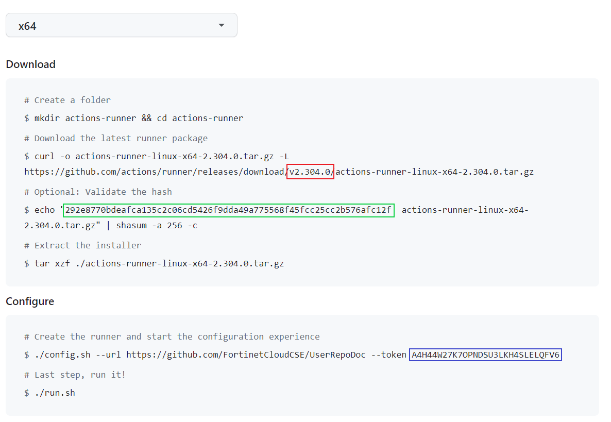
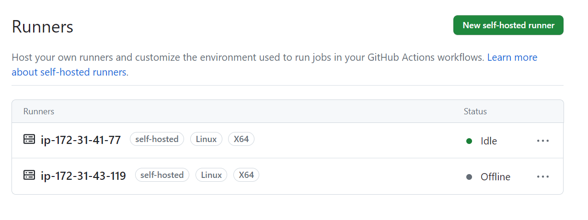

# Creating a New GitHub Actions Runner

This CloudFormation Template can be used to quickly spin up a GitHub Actions Runner on an EC2 instance. 

## Prereqs

- Pre-existing VPC.

- GitHub repo already setup and ready to integrate with GitHub Actions.


## Launch using the AWS CLI

- Set the user profile and region environment variables.

```
export AWS_DEFAULT_REGION=us-east-1 && export AWS_PROFILE=user-admin
```

### Parameters

- In GitHub, click **Settings → Actions → Runners → New self-hosted runner** and select the Linux image.
- Populate `launch-runner-params.json` with the following values (keep secrets out of version control):
  * `VPCtoUse`: An existing VPC.
  * `SubnetId`: A private subnet in the VPC with internet egress (NAT Gateway or Internet Gateway).
  * `KeyPair`: Existing EC2 key pair name for break-glass SSH access.
  * `InstanceType`: Defaults to `t3.large`; adjust for your workload profile.
  * `RootVolumeSize`: Root disk size in GiB (default 50).
  * `OrgName` and `RepoName`: From the GitHub URL (`https://github.com/<Org>/<Repo>`).
  * `RunnerVersion`: From the GitHub runner download section (for example `2.307.1` as in red box in example below).
  * `GHAToken`: A registration token generated in the GitHub wizard. Tokens expire after 60 minutes—store them in AWS Systems Manager Parameter Store (SecureString) or fetch just-in-time when you deploy. (Purple box in example below.)
  * `HashCheck`: SHA-256 hash from the runner release asset page; ensures the download is trusted. (Green box in example below.)

  
 
  GitHub CLI alternative for obtaining a registration token:

  ```
  gh auth login
  gh api \
    --method POST \
    -H "Accept: application/vnd.github+json" \
    -H "X-GitHub-Api-Version: 2022-11-28" \
    /repos/<repo owner or organization>/<repo name>/actions/runners/registration-token | jq -r .token
  ```

  Example `launch-runner-params.json`:

```
[
    {
        "ParameterKey": "VPCtoUse",
        "ParameterValue": "vpc-abcd1234"
    },
    {
        "ParameterKey": "GHAToken",
        "ParameterValue": "A4H44WZT5RK4EOBUG5FZV2TEKKN4W"
    },
    {
        "ParameterKey": "SubnetId",
        "ParameterValue": "subnet-0123456789abcdef0"
    },
    {
        "ParameterKey": "KeyPair",
        "ParameterValue": "MyKeyPair"
    },
    {
        "ParameterKey": "InstanceType",
        "ParameterValue": "t3.large"
    },
    {
        "ParameterKey": "HashCheck",
        "ParameterValue": "292e8770bdeafca135c2c06cd5426f9dda49a775568f45fcc25cc2b576afc12f"
    },
    {
        "ParameterKey": "OrgName",
        "ParameterValue": "MyOrg"
    },
    {
        "ParameterKey": "RepoName",
        "ParameterValue": "MyRepo"
    },
    {
        "ParameterKey": "RunnerVersion",
        "ParameterValue": "2.307.1"
    },
    {
        "ParameterKey": "RootVolumeSize",
        "ParameterValue": "50"
    }
]
```
- Launch the CloudFormation stack:

```
aws cloudformation create-stack --stack-name <stack-name> \
  --template-body file://./launch-runner-ec2.yml \
  --parameters file://./launch-runner-params.json \
  --capabilities CAPABILITY_NAMED_IAM
```
- Monitor the stack in the CloudFormation console. When provisioning finishes, the runner appears on the GitHub Actions **Runners** page.

  

- Stack outputs expose `RunnerInstanceId`, `RunnerIamRoleArn`, and `RunnerSecurityGroupId` for downstream automation.

- The instance configures a `github-actions-runner` systemd service running as `runner-user`. Use Session Manager to check status (`sudo systemctl status github-actions-runner`) or view logs (`journalctl -u github-actions-runner`).

- The EC2 instance uses AWS Systems Manager Session Manager for access—no inbound security group rules are opened by default.

* To let the runner interact with an Amazon EKS cluster, note the runner role ARN from the CloudFormation outputs and run:

```
eksctl create iamidentitymapping --cluster <cluster name> --region $AWS_DEFAULT_REGION --arn <runner IAM role ARN> --group system:masters --username admin
```
